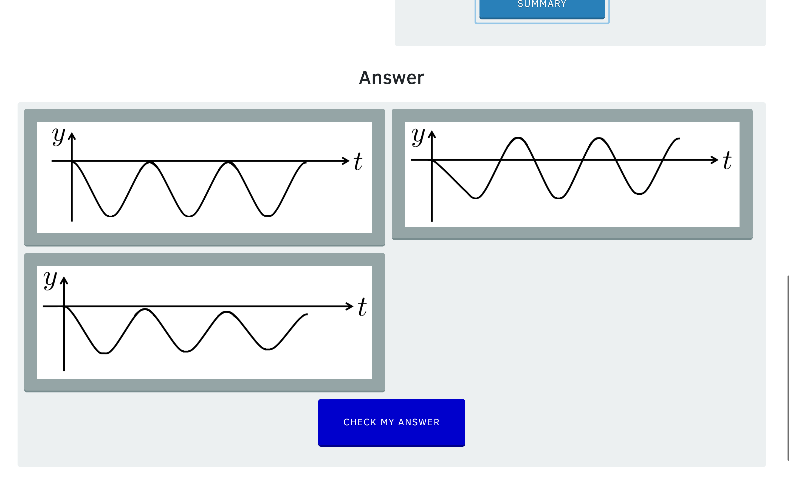

# wad assignment 1

Author: 22018990
Date: 2023-03-11

## Introduction
_The key words "MUST", "MUST NOT", "REQUIRED", "SHALL", "SHALL NOT", "SHOULD", "SHOULD NOT", "RECOMMENDED", "MAY", and "OPTIONAL" in this document are to be interpreted as described in RFC 2119._

Project is based on nodejs.
To run the test execute the command:

```
npm run test
```

I have created two distinct files with relative test suite:

* data.js
* answer.js

The first aims to test the correctness of the returned JSON response, the second contains answer-related functions like `is_correct`. 
The function checks whenevers the user's answer(s) is(are) correct(s).

### The test suites
All the test titles inside a test suite are descriptive on what the test is checking.
Some tests like `TC12 check that there is only 1 correct answer if answertype is radio or more if checkbox` are corollary of logic observations about the scope of the website.

All the tests inside each suite have been enumerated with the prefix TC (Test Case) and a progressive number.
This is a personal practice which help me to identify and the search on the source code in case of debug.

## data.js

The test suite prepared aims to check the correct format response for the website https://i-want-to-study-engineering.org.
The response has been provided by the tutor through the link https://github.com/1122131uhi/WAD1122131/blob/main/balances.json .

However, while studying the provided response and the website I have found that those responses differ between them. 
It is very likely that the website has been updated while the module has been prepared.
The actual response for the "balances problem" is visible on `balances_actual.txt` in this repository.

Before start the test the website has been analysed in order to find variations between different questions. 
By looking some of the questions I have deducted the following points:

* a question MUST have a text
* a question MAY have an image. Below a question without image.
* a question MAY have answers expressed as images  

I have not check all the answers in the websites, however, by looking the response provided by the tutor, the `"answertype": "radio",` suggests that a question MAY have multiple responses.
With this is mind the `answer.js` function will cope with _radio_ and _checkbox_ type of answer.

The main strategy of the test is to check that an object has all the requested properties of the exact type.
By looking the response we can see that there is a property `balances`

```
{
  gravity_s: {
    indexes: { question: [Array], slide: [Array], numberOfSlides: 5388 },
    questions: { house: [Object] }
  },
  spec_mom_s: {
    indexes: { question: [], slide: [Array], numberOfSlides: 328 },
    questions: {}
  },
  mom_s: {
    indexes: { question: [Array], slide: [Array], numberOfSlides: 4020 },
    questions: { house: [Object] }
  },
  balances: {
    hint: { titleColumn: [Array], video: [Array], title: [Array] },
    questions: { title: 'Balances', fullquestion: [Object] },
    idcourse: 3,
    orderofquestions: 99
  },
  spec_gravity_s: {
    indexes: { question: [], slide: [Array], numberOfSlides: 1024 },
    questions: {}
  },
  spec_strat_balan_s: {
    indexes: { question: [Array], slide: [Array], numberOfSlides: 2154 },
    questions: { house: [Object] }
  },
  problem_s: {
    indexes: { question: [], slide: [], numberOfSlides: 1143 },
    questions: {}
  }
}
```
All the tests have been based on the `balances` property.
This because the other elements `gravity_s`, `spec_mom_s`, `spec_gravity_s`, `spec_strat_balan_s`, `problem_s` seems to be related to other parts of the websites.

## answer.js
It contains only one function `is_correct` which has this signature:

```
/**
 * Given and oject data a question name and user_
 * 
 * @param {object} data 
 * @param {string} question_name 
 * @param {array} user_answers
 */
function is_correct(data, question_name, numbers)
```

The function checks different cases like 
* `user_answers` is an array of numbers which are the indexes of the answers available on `data` that the user considers as correct answer 
* `user_answers` values of type strings, null etc. will be not considered
* multiple answers in case of 'checkbox' answertype
* `user_answers` order insensitive: supposing `[0, 3]` as correct answers the function matches `user_answers` as `[0, 3]` or `[3, 0]`


**Note: ** Despite the 'defensive programming' the function has been kept 'light' considering that `user_answer` array has
been validated and filtered before to be passed to the function.